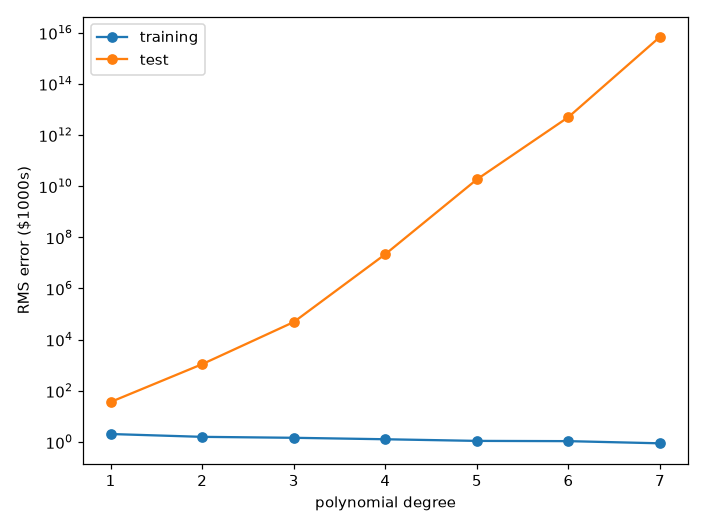
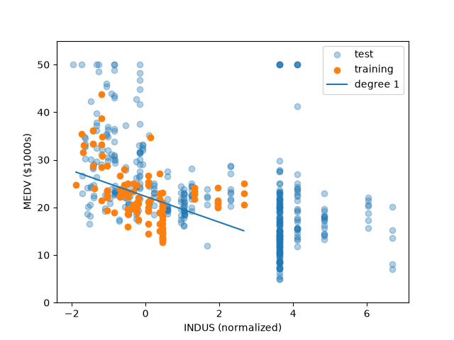
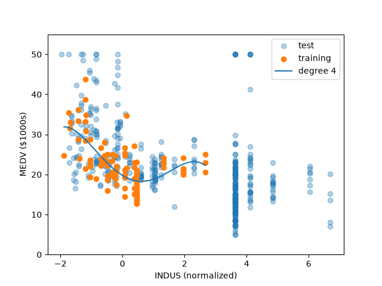
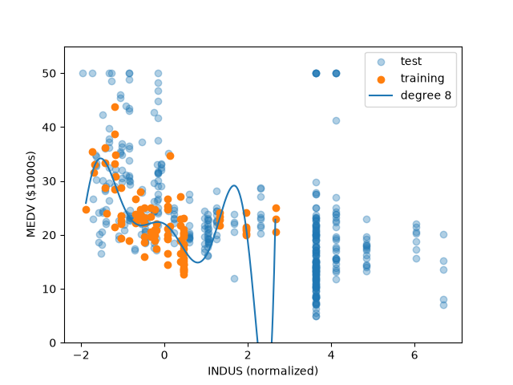
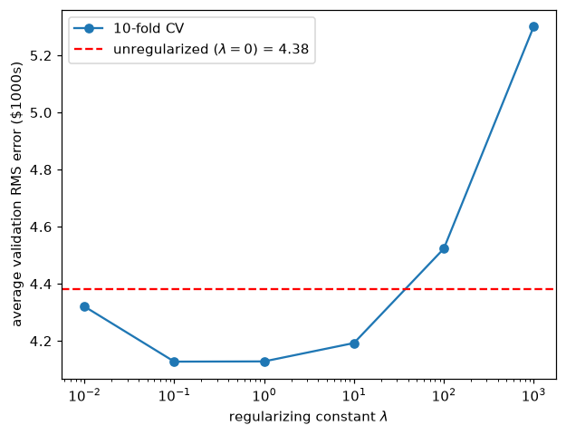
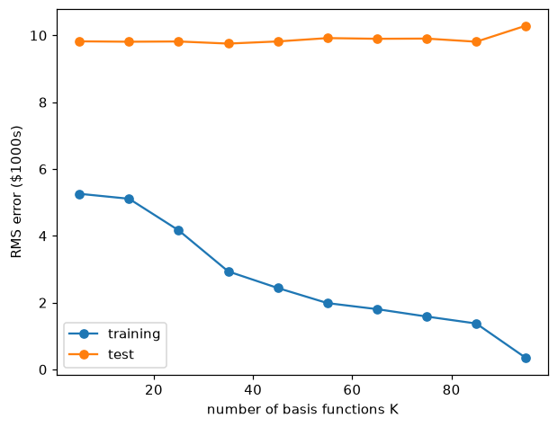
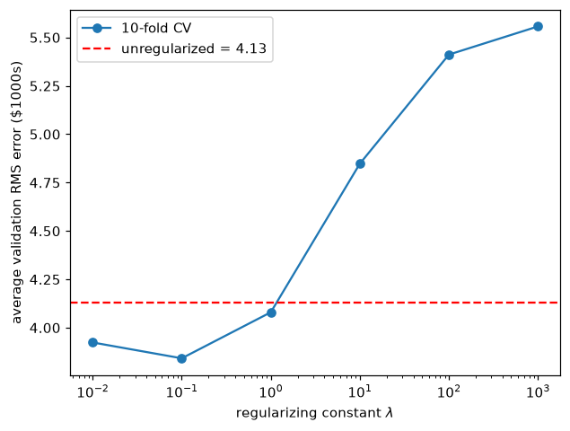

This assignment fits linear basis function regression to the Boston Housing dataset. We are predicting a town's median home value from 13 features. Part 1 uses a polynomial basis and part 2 a Gaussian basis, each first without regularization and then with an L2 penalty whose strength is chosen by 10-fold cross-validation.

## Setup

The dataset is the Boston Housing data, 506 towns with 13 features each. The target is MEDV (the median value of owner-occupied homes in thousands of dollars). The first 100 rows are the training set and the remaining 406 are the test set.

### The model

Linear basis function regression predicts the target as a weighted sum of fixed functions of the input. Each basis function $\phi_j$ maps the full input vector $\mathbf{x}$ to a single number, and the model holds one weight $w_j$ per basis function:

$$y(\mathbf{x}, \mathbf{w}) = \sum_{j=0}^{M-1} w_j \phi_j(\mathbf{x}) = \mathbf{w}^{\mathsf{T}} \boldsymbol{\phi}(\mathbf{x})$$

The $M$ basis functions are chosen before fitting and are never altered by it, so the weight vector $\mathbf{w}$ is the entire output of training. The model is linear in $\mathbf{w}$ even when the basis functions are nonlinear in $\mathbf{x}$, which is what lets a degree-7 polynomial be fitted by linear least squares.

### Loading the data

The file is whitespace-separated with no header, 506 rows of 14 values. Columns 0 to 12 are the features and column 13 is MEDV. We split the first 100 rows as our training data and the rest as testing data.

```python
housing_data_paths = os.path.join("data", "housing.data")

with open(housing_data_paths, 'r', encoding='utf-8') as file:
    arr = []
    for row in file:
        arr.append([float(n) for n in row.strip().split()])
    arr = np.array(arr)

names = ["CRIM", "ZN", "INDUS", "CHAS", "NOX", "RM", "AGE", "DIS",
         "RAD", "TAX", "PTRATIO", "B", "LSTAT", "MEDV"]

training_data_X = arr[:100, :13]
training_data_Y = arr[:100, -1]
test_data_X = arr[100:, :13]
test_data_Y = arr[100:, -1]
```

### Normalization

The feature values span wide ranges, and raising them to the 7th power makes the spread worse. For example, NOX feature to the power of 7 is $\approx 0.013$ while the TAX feature to the power of 7 is $\approx 5 \times 10^{18}$ on the training rows. Therefore, for each feature, we need to normalize/standardize the data.

$$\tilde{x}_{nj} = \frac{x_{nj} - \mu_j}{\sigma_j}, \qquad
\mu_j = \frac{1}{N}\sum_{n=1}^{N} x_{nj}, \qquad
\sigma_j = \sqrt{\frac{1}{N}\sum_{n=1}^{N}(x_{nj} - \mu_j)^2}$$

$\mu_j$ (mean) and $\sigma_j$ (standard deviation) are computed on the **training rows only** and the same values are applied to the test rows, so no information about the test set reaches the model.

```python
def fit_normalizer(X):
    mean = X.mean(axis=0)
    std = X.std(axis=0)
    std[std == 0] = 1  # no divide by zero
    return mean, std

def normalize(X, mean, std):
    return (X - mean) / std

mean, std = fit_normalizer(training_data_X)
training_data_Xn = normalize(training_data_X, mean, std)
test_data_Xn = normalize(test_data_X, mean, std)
```

The CHAS feature is identically zero across the first 100 rows, so $\sigma_{\text{CHAS}} = 0$ and the division is undefined. Since $x_{nj} - \mu_j$ is already zero for a constant column, substituting $\sigma_j = 1$ leaves the column at zero without introducing undefined behavior. However, this leaves the column identically zero rather than nan (not a number), and every power of zero is also zero, so the design matrix carries $d$ columns of zeros and is rank deficient. $\boldsymbol{\Phi}^{\mathsf{T}}\boldsymbol{\Phi}$ (Gram matrix) is consequently singular and the normal equations have infinitely many solutions, every one of them producing identical predictions, since whatever weight CHAS receives is multiplied by zero on all 100 training rows. The CHAS weights are therefore not estimated from the data at all but selected by the solver. np.linalg.lstsq returns the minimum-norm solution, which sets them to exactly zero, as the degree-1 weight table shows. The effect is that CHAS is dropped from the model entirely, including on the test set, where the 35 towns that do border the river normalize to 1 and are then multiplied by a zero weight.

### Polynomial basis without cross-terms

For a degree $d$ polynomial over $D = 13$ features, the basis uses only monomials of a single variable:

$$\boldsymbol{\phi}(\mathbf{x}) = \big[\, 1,\; x_1,\; x_1^2,\; \ldots,\; x_1^d,\; x_2,\; x_2^2,\; \ldots,\; x_2^d,\; \ldots,\; x_{13}^d \,\big]^{\mathsf{T}}$$

No cross-terms of the form $x_i x_j$ with $i \neq j$ appear, and the leading $1$ is the bias. Therefore the number of basis functions is

$$M = Dd + 1 = 13d + 1$$

so $M = 14$ at degree 1 and $M = 92$ at degree 7.

### Design matrix

Stacking $\boldsymbol{\phi}(\mathbf{x}_n)$ as rows for all $N$ points gives the **design matrix** $\boldsymbol{\Phi}$, with entries $\Phi_{nj} = \phi_j(\mathbf{x}_n)$:

$$\boldsymbol{\Phi} =
\begin{bmatrix}
1 & x_{1,1} & x_{1,1}^2 & \cdots & x_{1,13}^d \\
1 & x_{2,1} & x_{2,1}^2 & \cdots & x_{2,13}^d \\
\vdots & \vdots & \vdots & \ddots & \vdots \\
1 & x_{N,1} & x_{N,1}^2 & \cdots & x_{N,13}^d
\end{bmatrix}$$

A row is one town evaluated across every basis function and a column is one basis function evaluated across every town. The prediction vector is $\hat{\mathbf{y}} = \boldsymbol{\Phi}\mathbf{w}$.

```python
def design_matrix(A, order):
    ROWS, COLS = A.shape
    cols = [[1 for _ in range(ROWS)]]  # bias first
    for c in range(COLS):
        for power in range(1, order + 1):
            col = []
            for r in range(ROWS):
                col.append(A[r, c] ** power)
            cols.append(col)

    return np.column_stack(cols)
```

The bias column is created once, outside both loops. The column ordering is bias, then every power of feature 0, then every power of feature 1, and so on, which puts feature $i$ at power $p$ in column $1 + i \cdot d + (p - 1)$.

### Least squares

The weights minimize the sum of squared residuals:

$$E(\mathbf{w}) = \tfrac{1}{2}\sum_{n=1}^{N}\big(t_n - \mathbf{w}^{\mathsf{T}}\boldsymbol{\phi}(\mathbf{x}_n)\big)^2 = \tfrac{1}{2}\lVert \mathbf{t} - \boldsymbol{\Phi}\mathbf{w} \rVert^2$$

Expanding the second order norm with $\lVert \mathbf{v} \rVert^2 = \mathbf{v}^{\mathsf{T}}\mathbf{v}$:

$$E(\mathbf{w}) = \tfrac{1}{2}(\mathbf{t} - \boldsymbol{\Phi}\mathbf{w})^{\mathsf{T}}(\mathbf{t} - \boldsymbol{\Phi}\mathbf{w})
 = \tfrac{1}{2}\big(\mathbf{t}^{\mathsf{T}}\mathbf{t} - 2\mathbf{w}^{\mathsf{T}}\boldsymbol{\Phi}^{\mathsf{T}}\mathbf{t} + \mathbf{w}^{\mathsf{T}}\boldsymbol{\Phi}^{\mathsf{T}}\boldsymbol{\Phi}\mathbf{w}\big)$$

The first term does not contain $\mathbf{w}$ and differentiates to zero. The second is linear, and $\nabla_{\mathbf{w}}(\mathbf{a}^{\mathsf{T}}\mathbf{w}) = \mathbf{a}$. The third is quadratic, and $\nabla_{\mathbf{w}}(\mathbf{w}^{\mathsf{T}}\mathbf{A}\mathbf{w}) = 2\mathbf{A}\mathbf{w}$ for symmetric $\mathbf{A}$, which $\boldsymbol{\Phi}^{\mathsf{T}}\boldsymbol{\Phi}$ is. Together:

$$\nabla_{\mathbf{w}} E = \tfrac{1}{2}\big(-2\boldsymbol{\Phi}^{\mathsf{T}}\mathbf{t} + 2\boldsymbol{\Phi}^{\mathsf{T}}\boldsymbol{\Phi}\mathbf{w}\big) = \boldsymbol{\Phi}^{\mathsf{T}}\boldsymbol{\Phi}\mathbf{w} - \boldsymbol{\Phi}^{\mathsf{T}}\mathbf{t}$$

Setting the gradient to zero gives the normal equations, and multiplying on the left by $(\boldsymbol{\Phi}^{\mathsf{T}}\boldsymbol{\Phi})^{-1}$ isolates the weights:

$$\boldsymbol{\Phi}^{\mathsf{T}}\boldsymbol{\Phi}\,\mathbf{w} = \boldsymbol{\Phi}^{\mathsf{T}}\mathbf{t}
\qquad \Longrightarrow \qquad
\mathbf{w} = \big(\boldsymbol{\Phi}^{\mathsf{T}}\boldsymbol{\Phi}\big)^{-1}\boldsymbol{\Phi}^{\mathsf{T}}\mathbf{t}$$

The inverse is not formed in code. $\boldsymbol{\Phi}^{\mathsf{T}}\boldsymbol{\Phi}$ is singular here because of the constant CHAS column, so the solution is obtained by singular value decomposition instead, which `np.linalg.lstsq` does implicitly.

### Error measure

$$E_{\text{RMS}} = \sqrt{\frac{1}{N}\sum_{n=1}^{N}\big(\hat{y}_n - t_n\big)^2}$$

The square root returns the units to those of MEDV, thousands of dollars.

```python
def fit(Phi, y):
    # least squares weights for Phi
    w, _, _, _ = np.linalg.lstsq(Phi, y, rcond=None)
    return w


def rms_error(Phi, w, y):
    return np.sqrt(np.mean((Phi @ w - y) ** 2))
```

## Part 1a: Error versus polynomial degree

Degrees 1 through 7, no regularization, fitted on the first 100 points and evaluated on the remaining 406. The same weights are scored on both sets; the test rows never enter the fit.

```python
train_errors = []
test_errors = []
for order in range(1, 8):
    Phi_train = design_matrix(training_data_Xn, order)
    Phi_test = design_matrix(test_data_Xn, order)

    w = fit(Phi_train, training_data_Y)

    train_errors.append(rms_error(Phi_train, w, training_data_Y))
    test_errors.append(rms_error(Phi_test, w, test_data_Y))
```

| Degree | $M$ | Training RMS | Test RMS |
| --- | --- | --- | --- |
| 1 | 14 | 2.0372 | 36.4449 |
| 2 | 27 | 1.5781 | 1097.1883 |
| 3 | 40 | 1.4491 | $4.8673 \times 10^{4}$ |
| 4 | 53 | 1.2705 | $2.1859 \times 10^{7}$ |
| 5 | 66 | 1.0966 | $1.8358 \times 10^{10}$ |
| 6 | 79 | 1.0725 | $5.0241 \times 10^{12}$ |
| 7 | 92 | 0.8815 | $6.8793 \times 10^{15}$ |



The y axis is logarithmic because the test error spans roughly fourteen orders of magnitude across the degrees shown.

Training RMS falls monotonically with degree, from 2.0372 at degree 1 to 0.8815 at degree 7. Each added degree contributes 13 more free weights, and 92 weights fitted to 100 points can track the training targets closely. Test RMS moves the opposite way across the entire range, from 36.4449 to $6.9 \times 10^{15}$, so every degree past the first buys training accuracy at the cost of generalization.

This is overfitting as the additional weights describe the particular 100 training towns rather than a relationship that also holds for the remaining 406. Of the seven models, degree 1 has the lowest test error and is the one I would choose, though a test RMS of 36.4449 against a training RMS of 2.0372 means even it generalizes poorly. Read on its own, the training curve selects degree 7, which is the worst of the seven by fourteen orders of magnitude, and that gap is why model selection cannot be based on training error.

## Part 1b: Examining the learned weights

Degree 1, so $M = 14$: one bias plus one weight per feature. Because the features are standardized, each weight is the change in MEDV (in thousands of dollars) per one standard deviation of that feature.

Dividing a weight by that feature's $\sigma_j$ converts it back to natural units.

```python
w1 = fit(design_matrix(training_data_Xn, 1), training_data_Y)

print(f"{'bias':>4}  {'':<8}  {w1[0]:>9.4f}")
for i, name in enumerate(names[:13]):
    print(f"{i:>4}  {name:<8}  {w1[1 + i]:>9.4f}  {w1[1 + i] / std[i]:>13.4f}")
```

The weight vector has the bias prepended but `std` does not, so feature $i$ is `w1[1 + i]` and `std[i]`.

| Index | Feature | Weight (per $\sigma$) | Per natural unit |
| --- | --- | --- | --- |
| bias | | 22.3090 | |
| 0 | CRIM | -1.3380 | -3.4559 |
| 1 | ZN | 0.1230 | 0.0054 |
| 2 | INDUS | -0.5311 | -0.1688 |
| 3 | CHAS | -0.0000 | -0.0000 |
| 4 | NOX | 1.0027 | 21.5154 |
| 5 | RM | 4.1956 | 8.5910 |
| 6 | AGE | -2.1663 | -0.0792 |
| 7 | DIS | 0.0107 | 0.0076 |
| 8 | RAD | -0.1938 | -0.1399 |
| 9 | TAX | -0.3486 | -0.0076 |
| 10 | PTRATIO | 0.2613 | 0.1546 |
| 11 | B | 0.1811 | 0.0066 |
| 12 | LSTAT | 0.1488 | 0.0262 |

$w_5$ is the weight on RM, the average number of rooms per dwelling, at $+4.1956$ per standard deviation. One standard deviation of RM is $0.4884$ rooms, so this is about $+8.59$ thousand dollars per additional room.

$w_7$ is the weight on DIS, the weighted distance to five Boston employment centres, at $+0.0107$ per standard deviation, which is about $+\$11$ and indistinguishable from zero.

The bias is $22.3090$. Because standardized features have mean zero, the bias equals the training mean of MEDV.

To separate "DIS does not matter" from "DIS is collinear with features that absorbed it", DIS was also fitted on its own:

```python
Phi_dis = design_matrix(training_data_Xn[:, 7:8], 1)
w_dis = fit(Phi_dis, training_data_Y)
```

| Model | DIS weight | Training RMS |
| --- | --- | --- |
| DIS alone | +0.9418 | 5.8226 |
| All 13 features | +0.0107 | 2.0372 |
| Predict the training mean | n/a | 5.8983 |

Fitting DIS alone gives a training RMS of $5.8226$ against $5.8983$ for predicting the mean, a 1.3% improvement, so there is almost nothing to absorb and the feature genuinely does not predict MEDV across these 100 towns.

## Part 1c: One-dimensional visualization

Using only INDUS (feature index 2) so the fit can be drawn in the plane. The basis reduces to $\boldsymbol{\phi}(x) = [1, x, x^2, \ldots, x^d]^{\mathsf{T}}$, so $M = d + 1$.

NOTE: The handout's Xn(:,2) is read as a zero-indexed column, consistent with part b numbering the features from zero, so feature 2 is INDUS, the proportion of non-retail business acres per town (a one-indexed reading would instead give ZN).

```python
def polynomial_regression_1d_vis(feature_index, order, filename):
    x_train = training_data_Xn[:, feature_index:feature_index + 1]
    x_test = test_data_Xn[:, feature_index:feature_index + 1]

    w = fit(design_matrix(x_train, order), training_data_Y)

    grid = np.linspace(x_train.min(), x_train.max(), 300).reshape(-1, 1)
    curve = design_matrix(grid, order) @ w

    fig, ax = plt.subplots()
    ax.scatter(x_test, test_data_Y, alpha=0.35, label="test")
    ax.scatter(x_train, training_data_Y, label="training")
    ax.plot(grid, curve, label=f"degree {order}")

    ax.set_xlabel(f"{names[feature_index]} (normalized)")
    ax.set_ylabel("MEDV ($1000s)")
    ax.set_ylim(0, 55)
    ax.legend()
    fig.savefig("media/" + filename)

for o in (1, 4, 8):
    polynomial_regression_1d_vis(2, o, f"indus-degree-{o}.png")
```



The straight line captures the broad downward trend, falling from about 28 to 15 across the training range, but it cannot bend to follow the flattening past $x = 1$ and so underfits: the model is too rigid to represent structure that is visibly present in the data.



The curve picks up the curvature the line misses, dropping steeply to a minimum near $x = 0.5$ and levelling off afterwards, and it stays smooth between the training points rather than passing through them, which is the behaviour wanted from a fit.



The curve oscillates to reach individual training points, with a peak near $x = 1.7$ that no group of points supports, and it leaves the bottom of the axis past $x = 2.3$. More seriously, the training data ends at $x = 2.66$ while 189 of the 406 test points lie beyond it, where the degree-8 polynomial predicts $4256$ at $x = 3.6$ and $1.66 \times 10^6$ at $x = 6.7$, because a high-order polynomial outside its fitting range is governed by its leading term.

## Part 1d: L2 regularization and cross-validation

The **L2 norm** of a vector is its ordinary straight-line length, $\lVert \mathbf{w} \rVert = \sqrt{w_0^2 + w_1^2 + \cdots + w_{M-1}^2}$. **L2 regularization** adds a multiple of its square to the error being minimized, so the fit now pays a price for large weights and will accept a slightly worse fit to the training data in exchange for smaller ones. The constant $\lambda$ sets that exchange rate: at $\lambda = 0$ the penalty vanishes and the ordinary least squares solution returns, and as $\lambda$ grows the weights are pulled toward zero.

The degree-7 fit from part 1a reached its low training error with weights large enough to turn into test predictions of $10^{15}$, and penalizing their magnitude is a direct way to suppress that without giving up the flexibility of a high-degree basis. The method is also known as ridge regression, which is where `ridge_fit` takes its name.

Adding a penalty on the squared magnitude of the weights gives

$$E(\mathbf{w}) = \tfrac{1}{2}\lVert \mathbf{t} - \boldsymbol{\Phi}\mathbf{w} \rVert^2 + \frac{\lambda}{2}\lVert \mathbf{w} \rVert^2$$

Expanding both terms with $\lVert \mathbf{v} \rVert^2 = \mathbf{v}^{\mathsf{T}}\mathbf{v}$:

$$E(\mathbf{w}) = \tfrac{1}{2}\big(\mathbf{t}^{\mathsf{T}}\mathbf{t} - 2\mathbf{w}^{\mathsf{T}}\boldsymbol{\Phi}^{\mathsf{T}}\mathbf{t} + \mathbf{w}^{\mathsf{T}}\boldsymbol{\Phi}^{\mathsf{T}}\boldsymbol{\Phi}\mathbf{w}\big) + \tfrac{\lambda}{2}\mathbf{w}^{\mathsf{T}}\mathbf{w}$$

The first group differentiates exactly as in the unregularized case. The penalty is quadratic in $\mathbf{w}$ with $\nabla_{\mathbf{w}}(\mathbf{w}^{\mathsf{T}}\mathbf{w}) = 2\mathbf{w}$, so the $\tfrac{\lambda}{2}$ cancels the 2 and it contributes $\lambda\mathbf{w}$:

$$\nabla_{\mathbf{w}} E = \boldsymbol{\Phi}^{\mathsf{T}}\boldsymbol{\Phi}\mathbf{w} - \boldsymbol{\Phi}^{\mathsf{T}}\mathbf{t} + \lambda\mathbf{w}$$

Setting this to zero and writing $\lambda\mathbf{w} = \lambda\mathbf{I}\mathbf{w}$ so that $\mathbf{w}$ can be factored out:

$$\big(\boldsymbol{\Phi}^{\mathsf{T}}\boldsymbol{\Phi} + \lambda\mathbf{I}\big)\mathbf{w} = \boldsymbol{\Phi}^{\mathsf{T}}\mathbf{t}
\qquad \Longrightarrow \qquad
\mathbf{w} = \big(\boldsymbol{\Phi}^{\mathsf{T}}\boldsymbol{\Phi} + \lambda\mathbf{I}\big)^{-1}\boldsymbol{\Phi}^{\mathsf{T}}\mathbf{t}$$


```python
def ridge_fit(Phi, y, lam):
    # least squares weights, but big weights cost lam each
    I = np.eye(Phi.shape[1])
    I[0, 0] = 0.0  # bias is not penalized
    return np.linalg.solve(Phi.T @ Phi + lam * I, Phi.T @ y)
```

The first diagonal entry is zeroed so the bias is excluded from the penalty, since otherwise the model is penalized for predicting a nonzero average house price.

**10-fold cross-validation.** Choosing $\lambda$ requires a way to compare models, and neither available error will do: training error always prefers $\lambda = 0$, since the penalty exists precisely to worsen the training fit, and using test error to choose $\lambda$ would let the test set influence the model and destroy its value as a measure of generalization. The solution is to hold out part of the training data instead. A validation set is data held out from fitting so that models can be compared, distinct from the test set, which is not touched here.

A holdout of 10 points out of 100 would both waste data and give a result that depends on which 10 were chosen. $k$-fold cross-validation (CV) avoids this by splitting the training points into $k$ equal groups, called folds, and running $k$ separate fits in which each fold takes a turn as the validation set while the remaining $k-1$ folds are used for training. Every point is therefore fitted on $k-1$ times and scored on once. Here $k = 10$, so the 100 training points are shuffled and split into 10 folds of 10, each $\lambda$ is fitted ten times, and the ten RMS scores are averaged:

$$\text{CV}(\lambda) = \frac{1}{10}\sum_{k=1}^{10} E_{\text{RMS}}^{(k)}(\lambda)$$

To describe the code below: for each $\lambda$ the inner loop walks the ten folds. val is a boolean mask marking the fold currently held out, so x[~val] and training_data_Y[~val] are the other 90 towns, and ridge_fit returns the weights learned from those alone. Scoring those weights with rms_error on the 10 held-out rows gives one error per fold, and the mean of the ten is $\text{CV}(\lambda)$, one entry in the returned list.

```python
def polynomial_regression_reg(x, order, lambdas, folds):
    shuffled = np.random.default_rng(0).permutation(len(x)) # returns 0-99 in random order
    means = []
    for lam in lambdas:
        errs = []
        for part in np.array_split(shuffled, folds):
            val = np.zeros(len(x), dtype=bool)
            val[part] = True
            w = ridge_fit(design_matrix(x[~val], order), training_data_Y[~val], lam)
            errs.append(rms_error(design_matrix(x[val], order), w, training_data_Y[val]))
        means.append(np.mean(errs))
    return means

lambdas = [0, 0.01, 0.1, 1, 10, 100, 1000]
cv = polynomial_regression_reg(training_data_Xn[:, 2:3], 8, lambdas, 10)
```

The shuffle is necessary because the rows are not in random order, as the constant CHAS column across the first 100 demonstrates. Without it, contiguous folds would group systematically similar towns together.

Degree 8 on INDUS, with $\lambda \in \{0,\ 0.01,\ 0.1,\ 1,\ 10,\ 100,\ 1000\}$:

| $\lambda$ | Average validation RMS |
| --- | --- |
| 0 | 4.3818 |
| 0.01 | 4.3204 |
| 0.1 | **4.1273** |
| 1 | 4.1281 |
| 10 | 4.1925 |
| 100 | 4.5230 |
| 1000 | 5.3003 |



$\lambda = 0$ cannot be drawn on a logarithmic axis, so it appears as the dashed horizontal baseline.

I would choose $\lambda = 0.1$. The curve has a flat basin across $\lambda = 0.1$ and $\lambda = 1$, which differ by $0.0008$ and are not meaningfully different at ten folds. The two sides of that basin are not symmetric, though: removing the penalty entirely costs $0.25$ relative to the minimum, while raising it to $\lambda = 1000$ costs $1.17$. Over-regularizing is the more expensive mistake, so taking the lower end of the flat region leaves the most distance from the steep rise on the right. Every $\lambda$ below roughly 30 improves on the unregularized baseline.

## Part 2: Gaussian basis functions

Replacing the monomials with Gaussians centred on data points:

$$\phi_j(\mathbf{x}) = \exp\!\left(-\frac{\lVert \mathbf{x} - \boldsymbol{\mu}_j \rVert^2}{2s^2}\right)$$

Each centre $\boldsymbol{\mu}_j$ is a randomly chosen training point, and the norm is taken across all 13 features at once, not one feature. $s$ controls the width and is not specified so $s = 1$ is used throughout, which is a reasonable scale given that the features are standardized.

Everything downstream is unchanged: the design matrix is still $\Phi_{nj} = \phi_j(\mathbf{x}_n)$ with a bias column prepended, and the weights still come from the normal equations.

```python
def gaussian_design_matrix(A, centers, s):
    # squared distance from every row of A to every center, across all 13 features
    d2 = np.zeros((len(A), len(centers)))
    for j, c in enumerate(centers):
        d2[:, j] = ((A - c) ** 2).sum(axis=1)
    return np.column_stack([np.ones(len(A)), np.exp(-d2 / (2 * s ** 2))])
```

The two bases behave in opposite ways far from the data. A monomial $x^d$ keeps growing as $x$ grows, so the weight on $x^8$ still controls the prediction no matter how far out a point sits, even though that weight was chosen to fit points in the middle of the training range. That is what produced the prediction of $1.66 \times 10^6$ in part 1c for the polynomial of degree 8.

A Gaussian does the reverse. It is largest at its own centre and shrinks toward zero as a point moves away from it, so a town far from every centre gets a value near zero from every basis function. All that is left is the bias, which is always 1, and the model predicts the average training price. That prediction is uninformative, but it is not absurd.

The usual names for this are local and global: a Gaussian is local, affecting predictions only within a bounded region around its centre, while a monomial is global, affecting them everywhere. The practicality of this is that a Gaussian model degrades toward the average away from its training data instead of diverging.

## Part 2e: Error versus number of basis functions

Centres are chosen by generating a random permutation of the training points and taking the first $K$, for $K = 5, 15, 25, \ldots, 95$ and no regularization.

```python
def gaussian_regression(Ks):
    shuffled = np.random.default_rng(0).permutation(len(training_data_Xn))
    train_errors, test_errors = [], []

    for K in Ks:
        centers = training_data_Xn[shuffled[:K]]
        Phi_train = gaussian_design_matrix(training_data_Xn, centers, 1)
        Phi_test = gaussian_design_matrix(test_data_Xn, centers, 1)

        w = fit(Phi_train, training_data_Y)

        train_errors.append(rms_error(Phi_train, w, training_data_Y))
        test_errors.append(rms_error(Phi_test, w, test_data_Y))
    return train_errors, test_errors

Ks = list(range(5, 100, 10))
train_errors, test_errors = gaussian_regression(Ks)
```

The permutation is drawn once, outside the loop, so the $K = 15$ centres contain all of the $K = 5$ centres. Increasing $K$ therefore adds basis functions rather than replacing them, and the curve measures the effect of the count alone. The same centres build both design matrices, since the centres are part of the fitted model and must come from training data only.

| $K$ | Training RMS | Test RMS |
| --- | --- | --- |
| 5 | 5.2575 | 9.8217 |
| 15 | 5.1094 | 9.8101 |
| 25 | 4.1635 | 9.8176 |
| 35 | 2.9336 | 9.7544 |
| 45 | 2.4371 | 9.8189 |
| 55 | 1.9855 | 9.9191 |
| 65 | 1.8047 | 9.8981 |
| 75 | 1.5832 | 9.9041 |
| 85 | 1.3748 | 9.8104 |
| 95 | 0.3444 | 10.2906 |



Training RMS falls steadily with $K$, from $5.2575$ at $K = 5$ to $0.3444$ at $K = 95$, since each added centre gives the fit another weight to place. The test curve does not respond at all: it stays between $9.75$ and $9.92$ across the whole range, rising only to $10.2906$ at $K = 95$, where the design matrix is $(100, 96)$ and carries nearly as many free parameters as data points.

Predicting the training mean gives a test RMS of $9.8339$, which is where the curve sits, so the model is returning the baseline for the test towns. That is what the Gaussian basis produces when a point lies far from every centre: all the exponentials are near zero, only the bias column survives, and the prediction is $w_0$. With $s = 1$ and 13 standardized features, the median squared distance between two training towns is $21.4$, and $\exp(-10.7) \approx 2 \times 10^{-5}$, so no basis function reaches appreciably past its own centre. The additional centres buy training accuracy by memorizing individual training towns and contribute nothing anywhere else.

The contrast with part 1a is the shape of the test curve. There it rose by fourteen orders of magnitude, here it is flat. A monomial grows without bound away from the origin, so an overfitted polynomial produces unbounded predictions, whereas a Gaussian decays to zero away from its centre, so the worst an overfitted Gaussian model can do on an unfamiliar town is fall back to the bias. Both models overfit, and only the polynomial basis lets the overfitting escape into the predictions.

## Part 2f: Regularized Gaussian regression

Same cross-validation procedure as part 1d, with the Gaussian design matrix and all 13 features, using 90 basis functions.

```python
def gaussian_regression_reg(K, lambdas, folds):
    x = training_data_Xn
    shuffled = np.random.default_rng(0).permutation(len(x))
    means = []
    for lam in lambdas:
        errs = []
        for part in np.array_split(shuffled, folds):
            val = np.zeros(len(x), dtype=bool)
            val[part] = True
            centers = x[~val][:K]

            Phi_t = gaussian_design_matrix(x[~val], centers, 1)
            Phi_v = gaussian_design_matrix(x[val], centers, 1)

            # lambda 0 is singular here, so lstsq instead of ridge_fit
            w = fit(Phi_t, training_data_Y[~val]) if lam == 0 else ridge_fit(Phi_t, training_data_Y[~val], lam)

            errs.append(rms_error(Phi_v, w, training_data_Y[val]))
        means.append(np.mean(errs))
    return means

cv = gaussian_regression_reg(90, lambdas, 10)
```

Two details differ from part 1d. The centres are taken from each fold's own 90 training rows rather than from all 100, which lands exactly on the 90 basis functions the question asks for and keeps the held-out rows out of the model entirely. And $\lambda = 0$ must be routed through `lstsq`.

| $\lambda$ | Average validation RMS |
| --- | --- |
| 0 | 4.1308 |
| 0.01 | 3.9238 |
| 0.1 | **3.8419** |
| 1 | 4.0799 |
| 10 | 4.8477 |
| 100 | 5.4116 |
| 1000 | 5.5571 |



I would choose $\lambda = 0.1$, which attains the lowest average validation error at $3.8419$. The curve rises to the left, giving $3.9238$ at $\lambda = 0.01$ and $4.1308$ unregularized, and steeply to the right, reaching $5.5571$ at $\lambda = 1000$. As in part 1d, over-regularizing costs more than under-regularizing, $1.72$ against $0.29$ relative to the minimum. Part 1d selected the same $\lambda$, but the grid contains seven values, six of them nonzero, spanning five decades, so this means only that the two optima fall in the same one of seven bins, and both curves are flat enough near the minimum that a factor of ten in $\lambda$ costs little. The shared value is a coincidence of a coarse grid rather than a property of the problem.