## Part 1: Shortest distance from a point to a function

### Setup

For a point $(x_0, y_0)$ and a curve $y = f(x)$, minimize the squared distance

$$D(x) = (x - x_0)^2 + \big(f(x) - y_0\big)^2$$

We use this because it is the square of the Euclidean distance function, and the square root is monotonically increasing. Hence we only need to care about the argument of the square root, as shown above, and it is less computationally expensive. So the goal is to find the point on $y = f(x)$ that minimizes $D(x)$.

### Analytical solution

We can solve for the $x$ that yields the minimum distance by taking the derivative of $D(x)$ and setting it to zero:

$$D'(x) = 2(x - x_0) + 2\big(f(x) - y_0\big)f'(x) = 0$$

For $y = x^2 + 5$, this becomes:

$$(x - x_0) + 2x\big(x^2 + 5 - y_0\big) = 0$$

$$x - x_0 + 2x^3 + 10x - 2xy_0 = 0$$

All sample points have $y_0 = 0$, so this reduces to:

$$2x^3 + 11x - x_0 = 0$$

Take $(0, 0)$ and substitute:

$$2x^3 + 11x = x(2x^2 + 11) = 0$$

There is only one real root, at $x = 0$, so the minimum of $D(x)$ must be at $x = 0$ on the parabola. Finding the $y$ value on the parabola is trivial: $y = 5$, so the closest point on the parabola to $(0, 0)$ is $(0, 5)$.

We can repeat the process for the other points $(-4, 0)$, $(-8, 0)$, $(2, 0)$ and $(6, 0)$ to get

$$2x^3 + 11x + 4 = 0, \qquad 2x^3 + 11x + 8 = 0, \qquad 2x^3 + 11x - 2 = 0, \qquad 2x^3 + 11x - 6 = 0$$

respectively. Using Cardano's rule or a graphing calculator, the closest matching points are $(-0.355, 5.126)$, $(-0.672, 5.452)$, $(0.181, 5.033)$ and $(0.520, 5.270)$. In tabular form:

| Point $(a, 0)$ | Equation to solve | Closest point on the curve |
| --- | --- | --- |
| $(0, 0)$ | $2x^3 + 11x = 0$ | $(0, 5)$ |
| $(-4, 0)$ | $2x^3 + 11x + 4 = 0$ | $(-0.355, 5.126)$ |
| $(-8, 0)$ | $2x^3 + 11x + 8 = 0$ | $(-0.672, 5.452)$ |
| $(2, 0)$ | $2x^3 + 11x - 2 = 0$ | $(0.181, 5.033)$ |
| $(6, 0)$ | $2x^3 + 11x - 6 = 0$ | $(0.520, 5.270)$ |

### Newton-Raphson

For Newton's method we need the second order derivative of the distance function.

$$x_{k+1} = x_k - \frac{D'(x_k)}{D''(x_k)}$$

$$D'(x) = 2(x - x_0) + 2\big(f(x) - y_0\big)f'(x), \qquad D''(x) = 2 + 2f'(x)^2 + 2\big(f(x) - y_0\big)f''(x)$$

For $y = x^2 + 5$ we have $f'(x) = 2x$ and $f''(x) = 2$, so

$$D'(x) = 2(x - x_0) + 4x\big(x^2 + 5 - y_0\big), \qquad D''(x) = 2 + 8x^2 + 4\big(x^2 + 5 - y_0\big)$$

Newton's method here is an iterative method for finding a good approximation of the zeroes of a function, provided we know the first and second order derivatives and we have a good initial guess.

Every run below starts from the initial guess $x_0 = 0$.

| Point | Iteration | $x_k$ | $f(x_k)$ | $D'(x_k)$ | $D''(x_k)$ | $x_{k+1}$ |
| --- | --- | --- | --- | --- | --- | --- |
| $(0, 0)$ | 1 | $0$ | $5$ | $0$ | $22$ | $0$ |
| $(-4, 0)$ | 1 | $0$ | $5$ | $8$ | $22$ | $-0.364$ |
| $(-4, 0)$ | 2 | $-0.364$ | $5.132$ | $-0.192$ | $23.587$ | $-0.355$ |
| $(-8, 0)$ | 1 | $0$ | $5$ | $16$ | $22$ | $-0.727$ |
| $(-8, 0)$ | 2 | $-0.727$ | $5.529$ | $-1.539$ | $28.347$ | $-0.673$ |
| $(2, 0)$ | 1 | $0$ | $5$ | $-4$ | $22$ | $0.182$ |
| $(2, 0)$ | 2 | $0.182$ | $5.033$ | $0.024$ | $22.397$ | $0.181$ |
| $(6, 0)$ | 1 | $0$ | $5$ | $-12$ | $22$ | $0.545$ |
| $(6, 0)$ | 2 | $0.545$ | $5.298$ | $0.649$ | $25.570$ | $0.520$ |

For $(0, 0)$ the first step returns $x_1 = 0 - \tfrac{0}{22} = 0$, so there is no second iteration. This converges immediately because the initial guess for $x_0$ was the exact critical point of the distance function.

### Golden section search

If we do not know the derivatives of a function, we can use another technique called golden section search to find its minimum. In our case we apply it to the distance function $D(x)$. The iterative process works from a lower bound and an upper bound.

$$\varphi = \frac{1 + \sqrt{5}}{2} \approx 1.618, \qquad \rho = 2 - \varphi \approx 0.382$$

Here is a brief explanation of how it works. Starting from a lower bound $a$ and an upper bound $b$, we compute two interior values $x_1$ and $x_2$, placed so that $a < x_1 < x_2 < b$ always. For a function $f(x)$, if $f(x_2) > f(x_1)$ then the minimum cannot lie above $x_2$, so we eliminate all $x > x_2$ and reassign $x_1$ and $x_2$ inside the new, smaller interval. This forces the iterative process to converge on a minimum.

The two interior values sit at

$$x_1 = a + \rho(b - a), \qquad x_2 = b - \rho(b - a)$$

and each iteration discards one end, leaving a bracket $1/\varphi \approx 0.618$ times as long as the last one.

If $D(x_1) < D(x_2)$ the minimum lies in $[a, x_2]$, otherwise it lies in $[x_1, b]$. The surviving $x$ value sits at the same golden ratio position in the new bracket, so each iteration after the first costs one evaluation of $D$ instead of two.

We do have to create an initial bracket for $a$ and $b$, and we can be smart about the guesses. We have a good idea of what $y = x^2 + 5$ looks like: a parabola symmetric about the $y$-axis, sitting a bit above the $x$-axis. So a point like $(-4, 0)$ can use an initial bracket of $[-4, 0]$, because for all $x > 0$ and all $x < -4$ the distance from $(-4, 0)$ strictly increases.

| Point | It. | Bracket $[a, b]$ | $x_1$ | $D(x_1)$ | $x_2$ | $D(x_2)$ | New bracket |
| --- | --- | --- | --- | --- | --- | --- | --- |
| $(0, 0)$ | 1 | $[-1, 1]$ | $-0.236$ | $25.616$ | $0.236$ | $25.616$ | $[-0.236, 1]$ |
| $(0, 0)$ | 2 | $[-0.236, 1]$ | $0.236$ | $25.616$ | $0.528$ | $28.143$ | $[-0.236, 0.528]$ |
| $(-4, 0)$ | 1 | $[-4, 0]$ | $-2.472$ | $125.799$ | $-1.528$ | $59.904$ | $[-2.472, 0]$ |
| $(-4, 0)$ | 2 | $[-2.472, 0]$ | $-1.528$ | $59.904$ | $-0.944$ | $44.049$ | $[-1.528, 0]$ |
| $(-8, 0)$ | 1 | $[-8, 0]$ | $-4.944$ | $876.394$ | $-3.056$ | $230.009$ | $[-4.944, 0]$ |
| $(-8, 0)$ | 2 | $[-4.944, 0]$ | $-3.056$ | $230.009$ | $-1.889$ | $110.736$ | $[-3.056, 0]$ |
| $(2, 0)$ | 1 | $[0, 2]$ | $0.764$ | $32.704$ | $1.236$ | $43.197$ | $[0, 1.236]$ |
| $(2, 0)$ | 2 | $[0, 1.236]$ | $0.472$ | $29.613$ | $0.764$ | $32.704$ | $[0, 0.764]$ |
| $(6, 0)$ | 1 | $[0, 6]$ | $2.292$ | $118.861$ | $3.708$ | $356.844$ | $[0, 3.708]$ |
| $(6, 0)$ | 2 | $[0, 3.708]$ | $1.416$ | $70.096$ | $2.292$ | $118.861$ | $[0, 2.292]$ |

For $(0, 0)$ the bracket is symmetric about the minimum, so $D(x_1) = D(x_2)$ on the first iteration and either end can be discarded.

### General computed results for $y = x^2 + 5$

| Point | Closest point | Distance | Newton steps | Golden section iterations |
| --- | --- | --- | --- | --- |
| $(0, 0)$ | $(0.000, 5.000)$ | 5.000 | 0 | 35 |
| $(-4, 0)$ | $(-0.355, 5.126)$ | 6.290 | 3 | 37 |
| $(-8, 0)$ | $(-0.672, 5.452)$ | 9.133 | 4 | 38 |
| $(2, 0)$ | $(0.181, 5.033)$ | 5.351 | 3 | 35 |
| $(6, 0)$ | $(0.520, 5.270)$ | 7.603 | 3 | 38 |

Here are some plots to visually articulate the different iterative methods for finding the shortest distance from the five points to the function $y = x^2 + 5$.

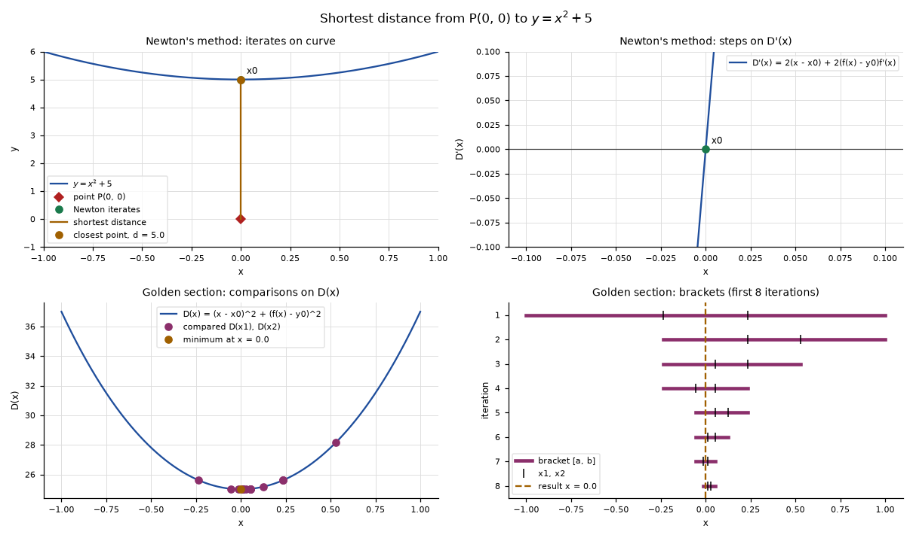

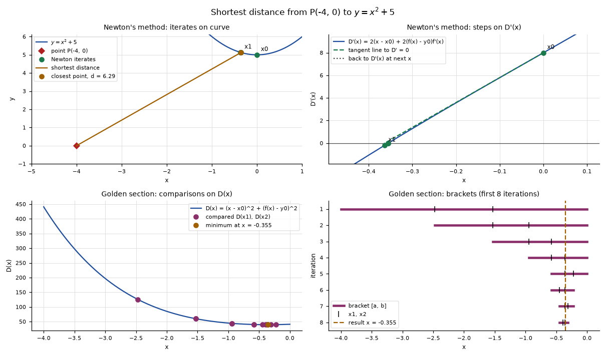

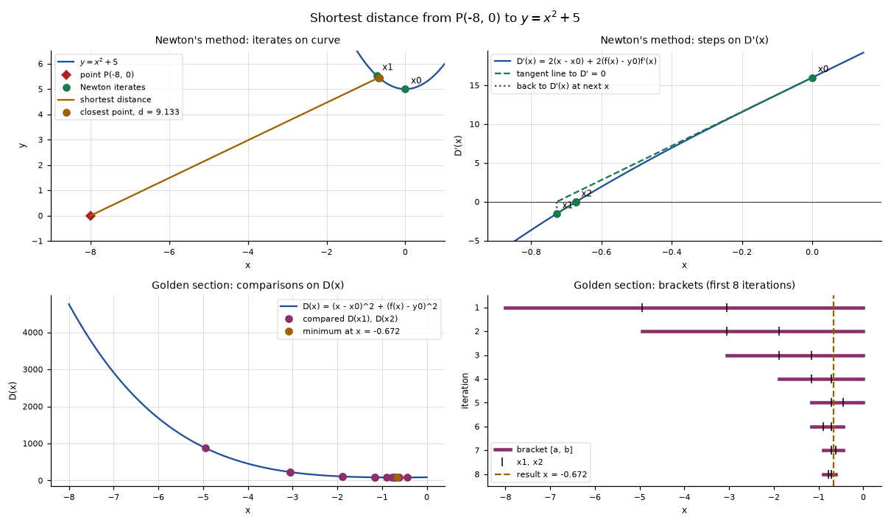

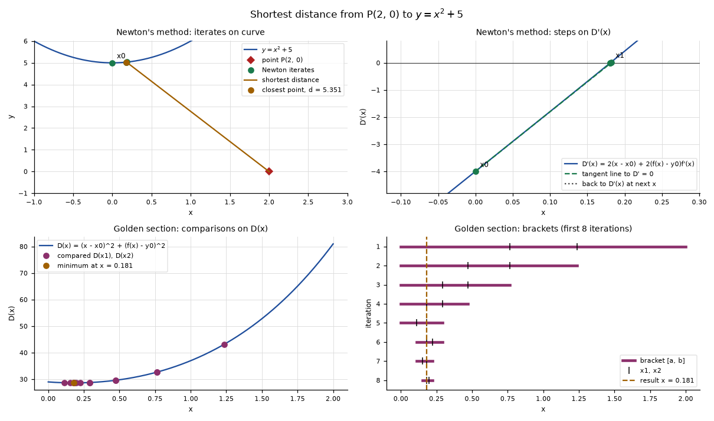

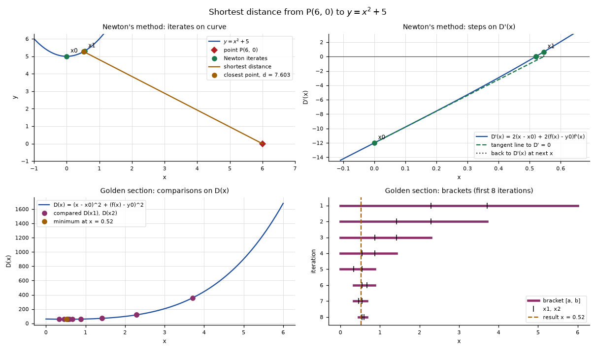

### Other parabolas

Here is an example of finding the shortest distance from a random point to a random parabola.

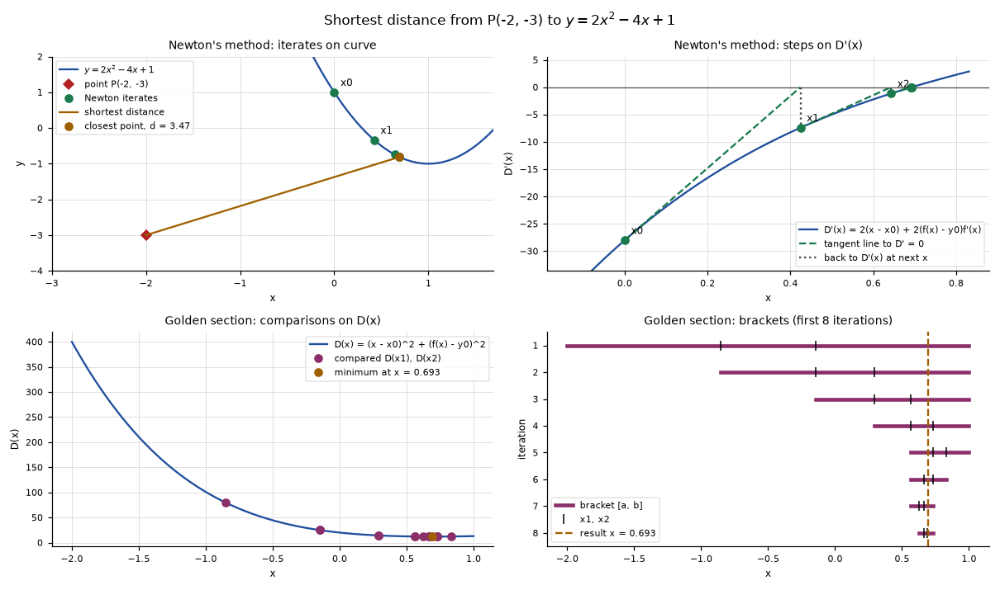

### Non-polynomial functions

And here are examples using a few other basic functions.

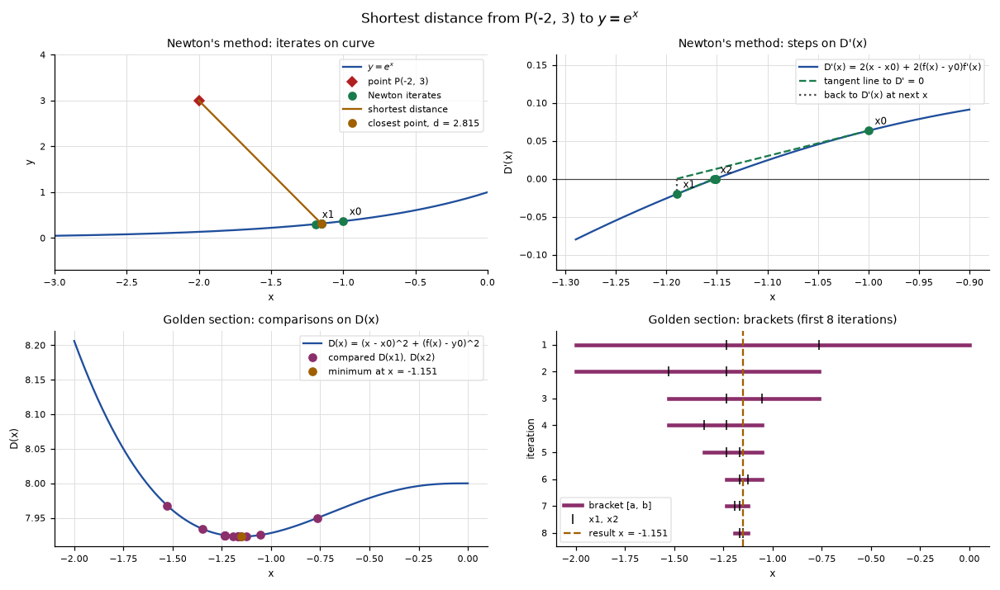

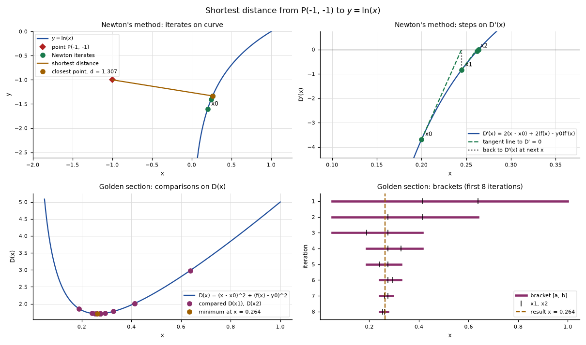

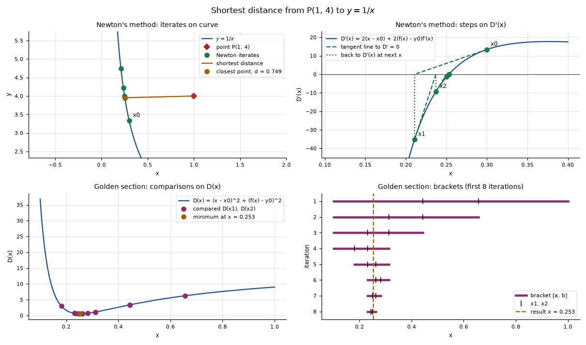

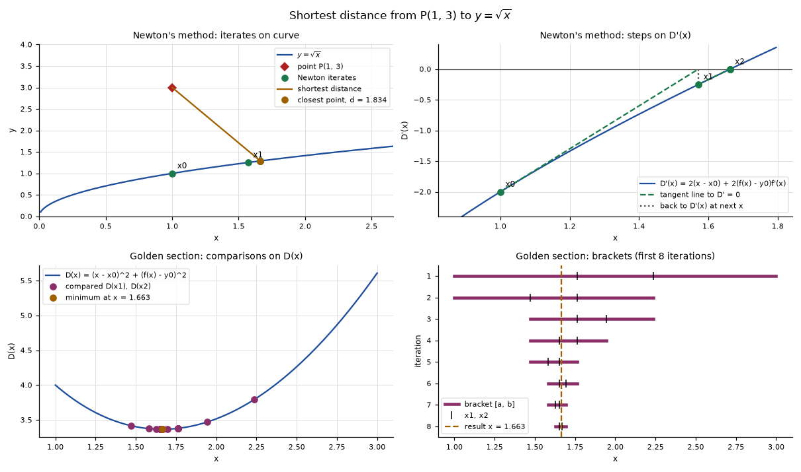

## Part 2: Fitting to an equation

### The data

We are given four points:

$$(0, 0.5), \quad (1, 1.5), \quad (2, 3.5), \quad (3, 7.5)$$

We want to fit a line and a parabola to these points as closely as we can, which we do by minimizing the mean squared error of the fitted function.

### The MSE function

A residual is the gap between a measured $y_i$ and what the model predicts at that same $x_i$. The mean squared error is the average of those residuals squared.

For the line $y = mx + b$:

$$\mathrm{MSE}(m, b) = \frac{1}{n}\sum_{i=1}^{n}\big(y_i - (m x_i + b)\big)^2$$

$$\mathrm{MSE}(m, b) = \tfrac{1}{4}\Big[(0.5 - b)^2 + \big(1.5 - (m + b)\big)^2 + \big(3.5 - (2m + b)\big)^2 + \big(7.5 - (3m + b)\big)^2\Big]$$

For the parabola $y = Bx^2 + Cx + D$:

$$\mathrm{MSE}(B, C, D) = \frac{1}{n}\sum_{i=1}^{n}\big(y_i - (B x_i^2 + C x_i + D)\big)^2$$

$$
\begin{aligned}
\mathrm{MSE}(B, C, D) = \tfrac{1}{4}\Big[&(0.5 - D)^2 + \big(1.5 - (B + C + D)\big)^2 \\
&+ \big(3.5 - (4B + 2C + D)\big)^2 + \big(7.5 - (9B + 3C + D)\big)^2\Big]
\end{aligned}
$$

### Analytical solution

At the minimum every partial derivative is zero. Writing $r_i = y_i - \hat{y}_i$ for the residual:

$$\frac{\partial\,\mathrm{MSE}}{\partial b} = -\frac{2}{n}\sum_i r_i, \qquad \frac{\partial\,\mathrm{MSE}}{\partial m} = -\frac{2}{n}\sum_i x_i r_i$$

$$\frac{\partial\,\mathrm{MSE}}{\partial D} = -\frac{2}{n}\sum_i r_i, \qquad \frac{\partial\,\mathrm{MSE}}{\partial C} = -\frac{2}{n}\sum_i x_i r_i, \qquad \frac{\partial\,\mathrm{MSE}}{\partial B} = -\frac{2}{n}\sum_i x_i^2 r_i$$

Setting them to zero and expanding gives equations in the data sums alone:

| $n$ | $\Sigma x$ | $\Sigma x^2$ | $\Sigma x^3$ | $\Sigma x^4$ | $\Sigma y$ | $\Sigma xy$ | $\Sigma x^2 y$ |
| --- | --- | --- | --- | --- | --- | --- | --- |
| 4 | 6 | 14 | 36 | 98 | 13 | 31 | 83 |

#### Line

$$\begin{aligned} \Sigma y - m\,\Sigma x - b\,n &= 0 &&\Longrightarrow& 6m + 4b &= 13 \\ \Sigma xy - m\,\Sigma x^2 - b\,\Sigma x &= 0 &&\Longrightarrow& 14m + 6b &= 31 \end{aligned}$$

In matrix form, with $A$ the design matrix whose columns are $x^0$ and $x^1$:

$$A = \begin{bmatrix} 1 & 0 \\ 1 & 1 \\ 1 & 2 \\ 1 & 3 \end{bmatrix}, \qquad \mathbf{y} = \begin{bmatrix} 0.5 \\ 1.5 \\ 3.5 \\ 7.5 \end{bmatrix}, \qquad \mathbf{c} = \begin{bmatrix} b \\ m \end{bmatrix}$$

$$A^{\mathsf{T}}A\,\mathbf{c} = A^{\mathsf{T}}\mathbf{y} \qquad\Longrightarrow\qquad \begin{bmatrix} 4 & 6 \\ 6 & 14 \end{bmatrix}\begin{bmatrix} b \\ m \end{bmatrix} = \begin{bmatrix} 13 \\ 31 \end{bmatrix}$$

$$\det(A^{\mathsf{T}}A) = 20, \qquad \mathbf{c} = \frac{1}{20}\begin{bmatrix} 14 & -6 \\ -6 & 4 \end{bmatrix}\begin{bmatrix} 13 \\ 31 \end{bmatrix} = \begin{bmatrix} -0.2 \\ 2.3 \end{bmatrix}$$

$$\boxed{\,y = 2.3x - 0.2\,}$$

#### Parabola

$$\begin{aligned} \Sigma y - B\,\Sigma x^2 - C\,\Sigma x - D\,n &= 0 &&\Longrightarrow& 14B + 6C + 4D &= 13 \\ \Sigma xy - B\,\Sigma x^3 - C\,\Sigma x^2 - D\,\Sigma x &= 0 &&\Longrightarrow& 36B + 14C + 6D &= 31 \\ \Sigma x^2 y - B\,\Sigma x^4 - C\,\Sigma x^3 - D\,\Sigma x^2 &= 0 &&\Longrightarrow& 98B + 36C + 14D &= 83 \end{aligned}$$

$$A = \begin{bmatrix} 1 & 0 & 0 \\ 1 & 1 & 1 \\ 1 & 2 & 4 \\ 1 & 3 & 9 \end{bmatrix}, \qquad \mathbf{c} = \begin{bmatrix} D \\ C \\ B \end{bmatrix}$$

$$A^{\mathsf{T}}A = \begin{bmatrix} 4 & 6 & 14 \\ 6 & 14 & 36 \\ 14 & 36 & 98 \end{bmatrix}, \qquad A^{\mathsf{T}}\mathbf{y} = \begin{bmatrix} 13 \\ 31 \\ 83 \end{bmatrix}$$

Row reducing the augmented system:

$$\left[\begin{array}{ccc|c} 4 & 6 & 14 & 13 \\ 6 & 14 & 36 & 31 \\ 14 & 36 & 98 & 83 \end{array}\right] \;\xrightarrow{\ \text{RREF}\ }\; \left[\begin{array}{ccc|c} 1 & 0 & 0 & 0.55 \\ 0 & 1 & 0 & 0.05 \\ 0 & 0 & 1 & 0.75 \end{array}\right]$$

$$\boxed{\,y = 0.75x^2 + 0.05x + 0.55\,}$$

### Mean squared error of each fit

| $x$ | $y$ | line $\hat{y}$ | line $r$ | parabola $\hat{y}$ | parabola $r$ |
| --- | --- | --- | --- | --- | --- |
| 0 | 0.5 | −0.20 | 0.70 | 0.55 | −0.05 |
| 1 | 1.5 | 2.10 | −0.60 | 1.35 | 0.15 |
| 2 | 3.5 | 4.40 | −0.90 | 3.65 | −0.15 |
| 3 | 7.5 | 6.70 | 0.80 | 7.45 | 0.05 |

| Model | Fit | $\Sigma r^2$ | MSE |
| --- | --- | --- | --- |
| Line | $y = 2.3x - 0.2$ | 2.3000 | 0.575000 |
| Parabola | $y = 0.75x^2 + 0.05x + 0.55$ | 0.0500 | 0.012500 |

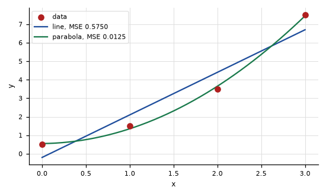

### Numerical solution: one parameter at a time

The assignment's method optimizes a single parameter with every other one held fixed, then moves to the next. Each step is a Newton-Raphson step on that parameter alone:

$$\theta \leftarrow \theta - \left.\frac{\partial\,\mathrm{MSE}}{\partial \theta}\right/\frac{\partial^2\mathrm{MSE}}{\partial \theta^2}$$

Solving for the second order derivatives gives, for example:

$$\frac{\partial^2\mathrm{MSE}}{\partial b^2} = \frac{2}{n}\,n = 2, \qquad \frac{\partial^2\mathrm{MSE}}{\partial m^2} = \frac{2}{n}\Sigma x^2 = 7, \qquad \frac{\partial^2\mathrm{MSE}}{\partial B^2} = \frac{2}{n}\Sigma x^4 = 49$$

Substituting and simplifying, the old value cancels and each update is that parameter's own normal equation solved for itself:

$$b \leftarrow \frac{\Sigma y - m\,\Sigma x}{n} = \frac{13 - 6m}{4}, \qquad m \leftarrow \frac{\Sigma xy - b\,\Sigma x}{\Sigma x^2} = \frac{31 - 6b}{14}$$

$$D \leftarrow \frac{13 - 6C - 14B}{4}, \qquad C \leftarrow \frac{31 - 6D - 36B}{14}, \qquad B \leftarrow \frac{83 - 14D - 36C}{98}$$

#### Line, starting from $m = 0$, $b = 0$

| Sweep | $b$ | $m$ | MSE |
| --- | --- | --- | --- |
| 0 | 0.000000 | 0.000000 | 17.750000 |
| 1 | 3.250000 | 0.821429 | 4.825893 |
| 2 | 2.017857 | 1.349490 | 2.331747 |
| 3 | 1.225765 | 1.688958 | 1.301002 |
| 4 | 0.716563 | 1.907187 | 0.875032 |
| 5 | 0.389219 | 2.047477 | 0.698993 |
| ⋮ | ⋮ | ⋮ | ⋮ |
| 40 | −0.200000 | 2.300000 | 0.575000 |

#### Parabola, starting from $B = C = D = 0$

| Sweep | $D$ | $C$ | $B$ | MSE |
| --- | --- | --- | --- | --- |
| 0 | 0.000000 | 0.000000 | 0.000000 | 17.750000 |
| 1 | 3.250000 | 0.821429 | 0.080904 | 4.665530 |
| 2 | 1.734694 | 1.262807 | 0.135237 | 1.615198 |
| 3 | 0.882460 | 1.488336 | 0.174137 | 0.673799 |
| 4 | 0.408015 | 1.591641 | 0.203967 | 0.389550 |
| 5 | 0.148656 | 1.626090 | 0.228363 | 0.303547 |
| 6 | 0.011594 | 1.622098 | 0.249410 | 0.273853 |
| 7 | −0.056081 | 1.596981 | 0.268304 | 0.258318 |
| 8 | −0.084536 | 1.560590 | 0.285737 | 0.245428 |
| ⋮ | ⋮ | ⋮ | ⋮ | ⋮ |
| 440 | 0.550000 | 0.050000 | 0.750000 | 0.012500 |

Substituting the $b$ rule into the $m$ rule collapses the line's two updates into one recurrence, whose slope is the factor the error shrinks by each sweep:

$$m_{k+1} = \frac{31 - 6\left(\frac{13 - 6m_k}{4}\right)}{14} = \frac{11.5 + 9m_k}{14}, \qquad \frac{9}{14} = 0.642857$$

### Numerical solution: full multivariate Newton-Raphson

Taking all the parameters at once, we collect them in one vector: $\mathbf{c} = [D, C, B]^{\mathsf{T}}$ for the parabola. The gradient stacks the first partials, and the Hessian is the matrix of every second partial, $H_{ij} = \partial^2\mathrm{MSE}/\partial c_i\,\partial c_j$:

$$
\nabla\mathrm{MSE} = \begin{bmatrix}
\dfrac{\partial\mathrm{MSE}}{\partial D} \\[2ex]
\dfrac{\partial\mathrm{MSE}}{\partial C} \\[2ex]
\dfrac{\partial\mathrm{MSE}}{\partial B}
\end{bmatrix},
\qquad
H = \begin{bmatrix}
\dfrac{\partial^2\mathrm{MSE}}{\partial D^2} & \dfrac{\partial^2\mathrm{MSE}}{\partial D\,\partial C} & \dfrac{\partial^2\mathrm{MSE}}{\partial D\,\partial B} \\[2ex]
\dfrac{\partial^2\mathrm{MSE}}{\partial C\,\partial D} & \dfrac{\partial^2\mathrm{MSE}}{\partial C^2} & \dfrac{\partial^2\mathrm{MSE}}{\partial C\,\partial B} \\[2ex]
\dfrac{\partial^2\mathrm{MSE}}{\partial B\,\partial D} & \dfrac{\partial^2\mathrm{MSE}}{\partial B\,\partial C} & \dfrac{\partial^2\mathrm{MSE}}{\partial B^2}
\end{bmatrix}
$$

The mixed partials are equal either way round, so $H$ is symmetric. Evaluating each entry on the four data points leaves only sums of powers of $x$, which is the same matrix as $\frac{2}{n}A^{\mathsf{T}}A$:

$$
H = \frac{2}{n}\begin{bmatrix}
n & \Sigma x & \Sigma x^2 \\
\Sigma x & \Sigma x^2 & \Sigma x^3 \\
\Sigma x^2 & \Sigma x^3 & \Sigma x^4
\end{bmatrix}
$$

The line case is the top-left $2 \times 2$ block of that, with $\mathbf{c} = [b, m]^{\mathsf{T}}$, which is where the $\begin{bmatrix} 2 & 3 \\ 3 & 7 \end{bmatrix}$ below comes from.

#### Line

$$H = \begin{bmatrix} 2 & 3 \\ 3 & 7 \end{bmatrix}, \qquad H^{-1} = \frac{1}{5}\begin{bmatrix} 7 & -3 \\ -3 & 2 \end{bmatrix}, \qquad \nabla\mathrm{MSE}\big|_{\mathbf{c} = \mathbf{0}} = \begin{bmatrix} -6.5 \\ -15.5 \end{bmatrix}$$

$$\mathbf{c} \leftarrow \begin{bmatrix} 0 \\ 0 \end{bmatrix} - \frac{1}{5}\begin{bmatrix} 7 & -3 \\ -3 & 2 \end{bmatrix}\begin{bmatrix} -6.5 \\ -15.5 \end{bmatrix} = \begin{bmatrix} 0 \\ 0 \end{bmatrix} - \begin{bmatrix} 0.2 \\ -2.3 \end{bmatrix} = \begin{bmatrix} -0.2 \\ 2.3 \end{bmatrix}$$

#### Parabola

$$H = \begin{bmatrix} 2 & 3 & 7 \\ 3 & 7 & 18 \\ 7 & 18 & 49 \end{bmatrix}, \qquad \nabla\mathrm{MSE}\big|_{\mathbf{c} = \mathbf{0}} = \begin{bmatrix} -6.5 \\ -15.5 \\ -41.5 \end{bmatrix}$$

Solving $H\mathbf{s} = \nabla\mathrm{MSE}$ by elimination:

$$\begin{aligned} 2s_1 + 3s_2 + 7s_3 &= -6.5 \\ 3s_1 + 7s_2 + 18s_3 &= -15.5 \\ 7s_1 + 18s_2 + 49s_3 &= -41.5 \end{aligned} \qquad\Longrightarrow\qquad \mathbf{s} = \begin{bmatrix} -0.55 \\ -0.05 \\ -0.75 \end{bmatrix}$$

$$\mathbf{c} \leftarrow \mathbf{0} - \mathbf{s} = \begin{bmatrix} 0.55 \\ 0.05 \\ 0.75 \end{bmatrix}$$

### Comparison

| Method | Line | Parabola |
| --- | --- | --- |
| Analytical (normal equations) | direct solve | direct solve |
| One parameter at a time | 40 sweeps | 440 sweeps |
| Full multivariate Newton-Raphson | 1 iteration | 1 iteration |

All three land on the same coefficients and the same MSE. Iteration counts are to a gradient tolerance of $10^{-7}$.

### Code

The design matrix is the only thing that changes between the two models, so one set of functions fits both.

```python
def design_matrix(points, order):
    cols = []
    for power in range(order + 1):
        col = []
        for x, _ in points:
            col.append(float(x) ** power)

        cols.append(col)

    A = np.column_stack(cols)
    b = np.array([y for _, y in points], dtype=float)

    return A, b
```

Analytical fit, solving $A^{\mathsf{T}}A\,\mathbf{c} = A^{\mathsf{T}}\mathbf{y}$ directly:

```python
def fit_polynominals(points, order):
    A, b = design_matrix(points, order)

    ATA = A.T @ A
    ATb = A.T @ b

    return np.linalg.solve(ATA, ATb)
```

One parameter at a time. Each inner step divides a first derivative by a second derivative, and writing `coeffs[j]` in place is what makes the next parameter see the update:

```python
def fit_coordinate_newton(points, order, tolerance=1e-7, max_sweeps=10000):
    A, b = design_matrix(points, order)
    ATA = A.T @ A
    ATb = A.T @ b
    n = len(points)

    coeffs = np.zeros(order + 1)
    history = []
    sweeps = 0

    for sweep in range(max_sweeps):
        history.append(coeffs.copy())

        gradient = -(2 / n) * (ATb - ATA @ coeffs)
        if np.max(np.abs(gradient)) < tolerance:
            break

        for j in range(order + 1):
            g = -(2 / n) * (ATb[j] - ATA[j] @ coeffs)
            h = (2 / n) * ATA[j, j]

            coeffs[j] = coeffs[j] - g / h

        sweeps = sweep + 1

    return coeffs, sweeps
```

Full multivariate Newton-Raphson. The Hessian is built once because it does not depend on the coefficients:

```python
def fit_hessian_newton(points, order, tolerance=1e-7, max_iter=100):
    xs = np.array([x for x, _ in points], dtype=float)
    ys = np.array([y for _, y in points], dtype=float)
    n = len(points)

    # H[j][k] = d2MSE/(dc_j dc_k) = (2/n) * sum of x^(j+k)
    H = np.zeros((order + 1, order + 1))
    for j in range(order + 1):
        for k in range(order + 1):
            H[j, k] = (2 / n) * np.sum(xs ** (j + k))

    coeffs = np.zeros(order + 1)
    iterations = 0
    history = []

    for i in range(max_iter):
        history.append(coeffs.copy())

        predictions = np.zeros(n)
        for j in range(order + 1):
            predictions += coeffs[j] * xs**j

        residual = ys - predictions

        # gradient[j] = dMSE/dc_j = -(2/n) * sum of x^j * residual
        gradient = np.zeros(order + 1)
        for j in range(order + 1):
            gradient[j] = -(2 / n) * np.sum(xs**j * residual)

        if np.max(np.abs(gradient)) < tolerance:
            break

        s = np.linalg.solve(H, gradient)   # H s = grad MSE
        coeffs = coeffs - s                # c <- c - s
        iterations = i + 1

    return coeffs, iterations
```

## Appendix: Hand work

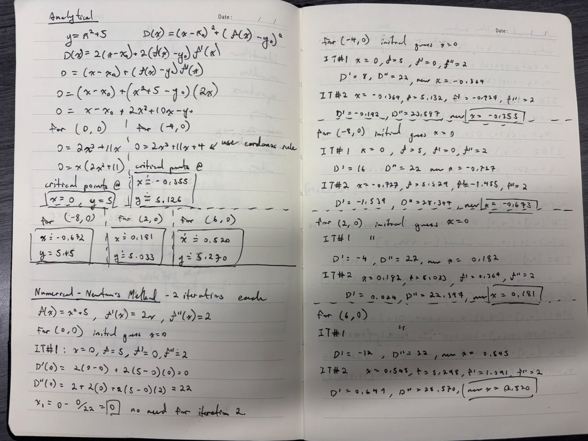

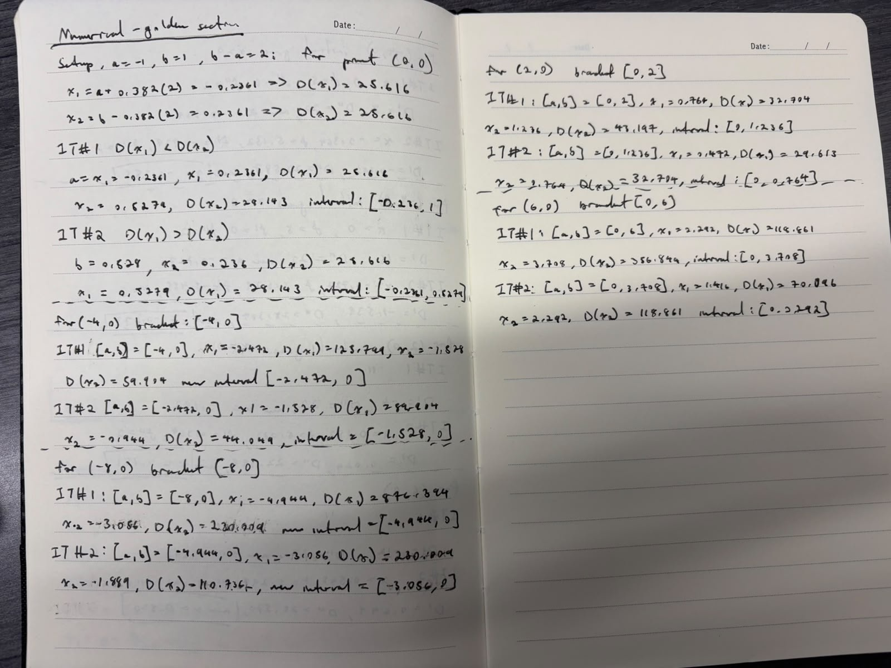

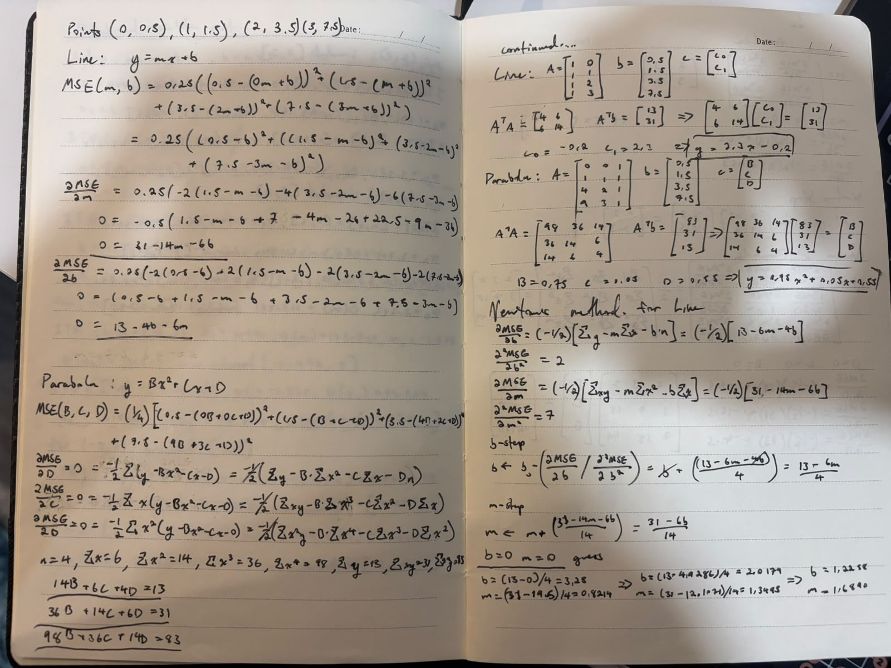

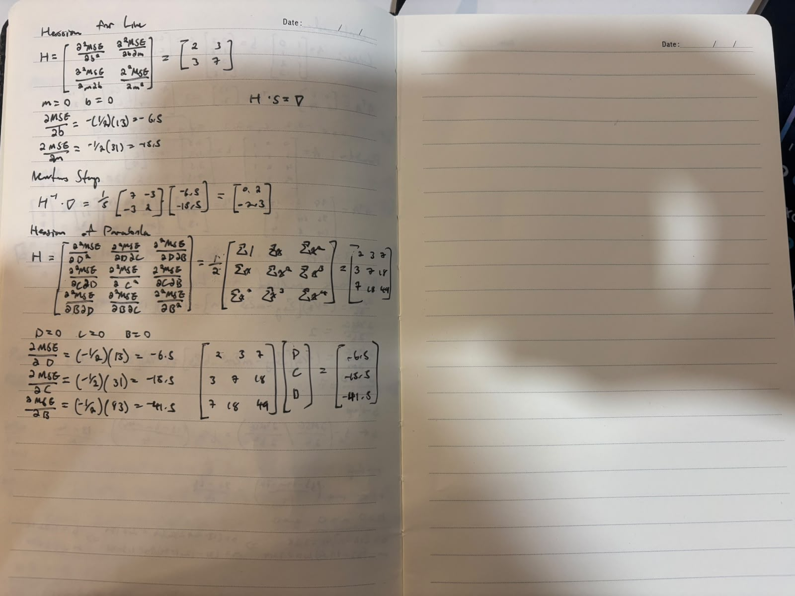
